#### Names of group members: Zach Leonardo, Jerfenson Cerda Mejia, Simon Burrows
#### Date: 26 November 2018

#### Describe your findings and their conclusions from your analysis.

#### Q1: The decline in marriage rates.
The article mentions declining marriage rates have reduced average male earnings, but increased average female earnings, reflecting the facts that single men tend to work less than married men, while the reverse is true for women. Declining marriage rates also account, mechanically, for much slower growth in earnings per household relative to earnings per capita.

As women have gained more rights and a higher social standing in recent years, they have become more independent. One way this independence has manifested has been working more and getting married later. As shown in our data, the percentage of women in the workforce in both Australia and Canada is increasing (See Figures 1 and 2). This is showing that with better societal standing, women are choosing to work more. One potential cause of this could be that it has become more accessible for people to create their own startup companies. The cost of startups has decreased recently, becoming very popular with the internet (See Figures 3 and 4). This could be a cause of more women joining the workforce since they can work jobs they want. Another factor has been women that are own-account workers, which means that they work on their own account (essentially self employed). In Canada, the percentage of women that are own-account workers is increasing while in Australia, it has been generally decreasing, although still a significant percentage at roughly 7% (See Figures 5 and 6). With women becoming own-account workers, they are taking more control over their lives, including employment, which could result in women not wanting to marry and therefore decreasing marriage rates.

All of these factors could be causes of declining marriage rates. The results of our multi-linear regression summary for Australia gave us a p-value of 0.0006276 as well as a multiple R-squared percentage of 74%. Similarly, the summary for Canada produced a very small p-value of 8.132e-05 and a multiple R-squared percentage of 82%. This is strong statistical evidence to prove that the percent of self employed female workers and the decreasing cost of startups can explain the rise of females in the labor force for both Australia and Canada. As women are working more and contributing less to the household, they are focusing on their own professional careers instead of marrying. These findings may be relevant to more of the world as society progresses, but based on our analysis we can only conclude this for the case of Canada and Australia, although it is most likely true for most developed, western countries. Overall we agree with Heathcote's conclusion about the declining marriage rates.

##### Figure 1: Labor force, female (% of total labor force) AU
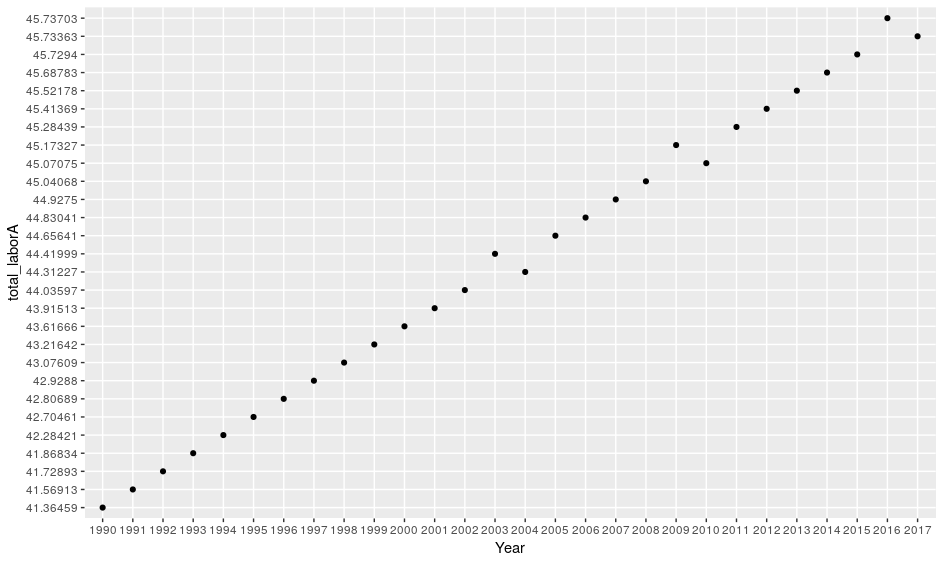
##### Figure 2: Labor force, female (% of total labor force) CA
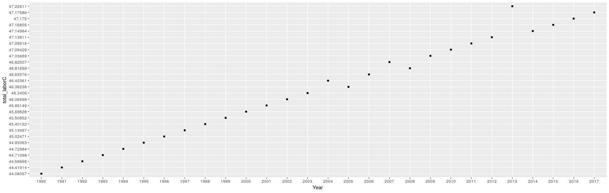
##### Figure 3: Time required to start a business, female (days) AU
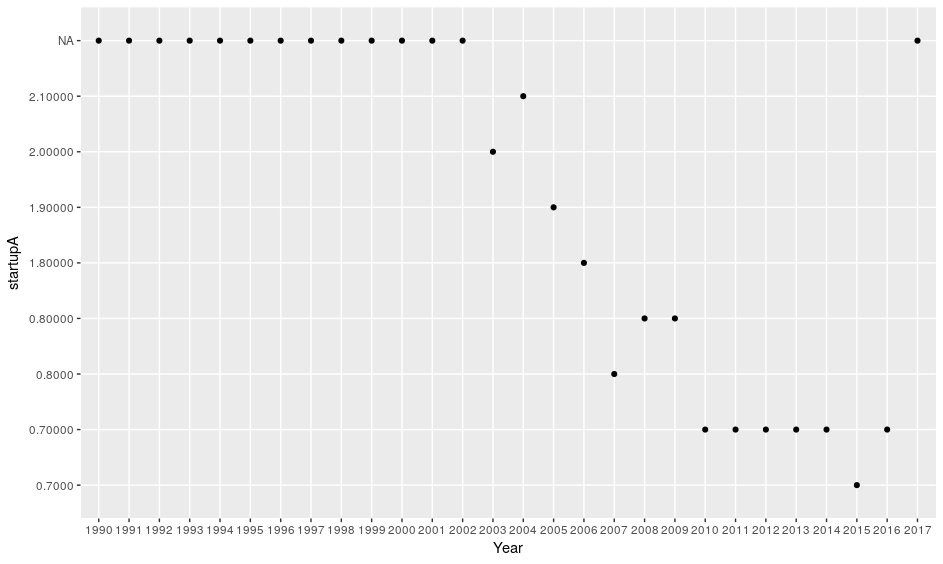
##### Figure 4: Time required to start a business, female (days) CA
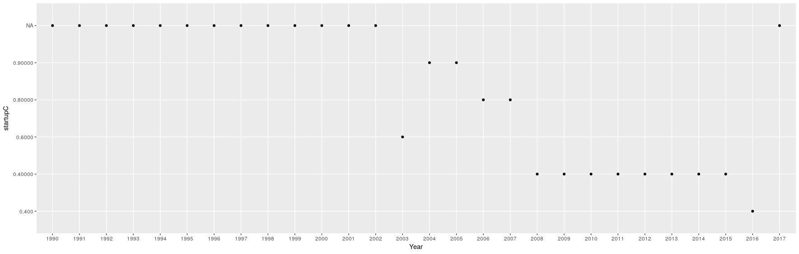
##### Figure 5: Own-account workers, female (% of females employed)  AU
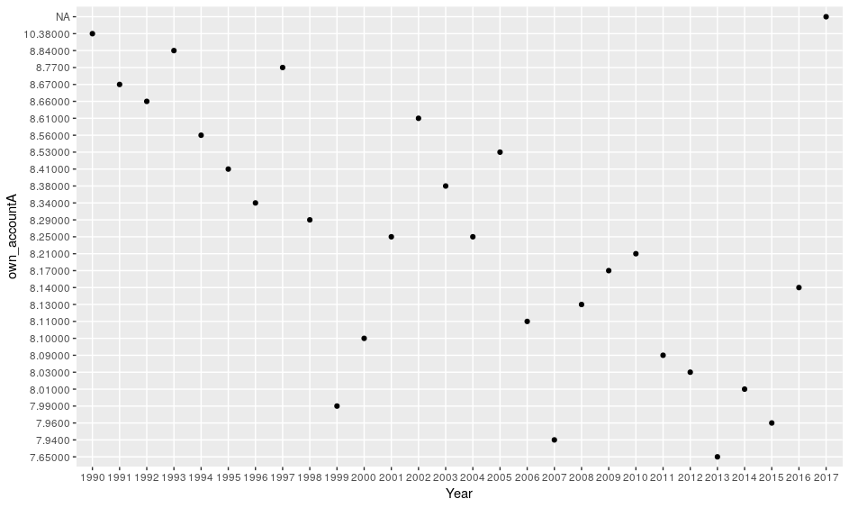
##### Figure 6: Own-account workers, female (% of females employed) CA
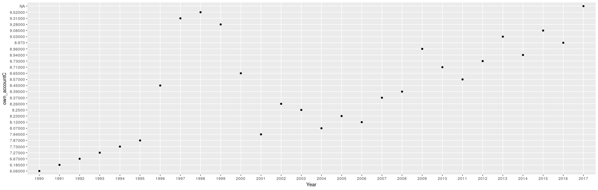

#### Q2: The narrowing gender wage gap
The article attributes the narrowing wage gap to labor demand shifts that favored women over men, as well as a decline in discrimination in the workplace over time.

The gender wage gap has always been a heated topic of debate. Recently, the gap has shrunk due to a multitude of factors. One major influence on this shrinking has been the amount of education women are receiving. Based on the data we have, in both Australia and Canada, the amount of women that are completing post-secondary school is increasing overall (See Figures 7 and 8). This is making the playing field more even for women since they are getting more education and are just as qualified as men. Additionally, the percentage of women that are wage and salaried workers is increasing too (See Figures 9 and 10). This means that there is an increasing percentage of women that get paid either hourly or with a salary, and not based on their sales (e.g. realtor or car salesman). As a result, women have a steadier income and can argue for equal pay since it is not based on performance. One last factor that we investigated was employment in industry. As more women are hired, they gain footing to argue for better wages and have more influence over their employers (See Figures 11 and 12). Recently, there has been a decline of women in industry but this may have less to do with wages and more to do with automation and robots replacing industry jobs, especially in developed countries such as Canada and Australia. Overall, the narrowing wage gap can be at least partially attributed to an increase in education, employment, and a change to wage and salary employment.

All these factors support evidence for a narrowing gender wage gap. The results of the multi-linear regression summary for Australia gave us a p-value of 0.0006416 and a multiple R-squared percentage of 80%. The model for Canada produced a p-value of 0.1873, but a multiple R-squared percentage of 96%. Based on these results, the education and wages have a strong effect on female industry employment in Australia, but due to the high p-value, the same conclusion can not be made for Canada. It is possible that outliers in the data caused inaccuracy when calculating said p-value considering that the R-squared percentage doesn't reflect the same result. Overall we can agree with Heathcote's conclusion about the narrowing gender wage gap in Australia but not in Canada with the data studied.

##### Figure 7: Educational attainment, completed Bachelor's or equivalent, population 25+ years, female (%) AU
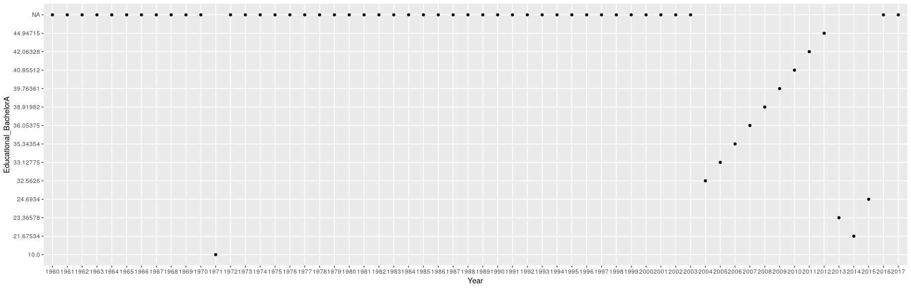
##### Figure 8: Educational attainment, completed Bachelor's or equivalent, population 25+ years, female (%) CA
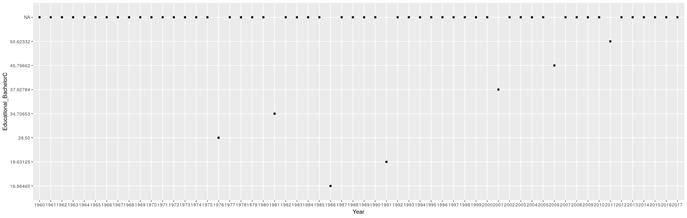
##### Figure 9: Wage and salaried workers, female (% of female employment) AU
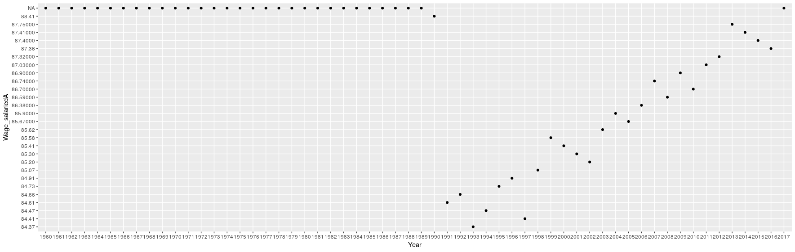
##### Figure 10: Wage and salaried workers, female (% of female employment) CA
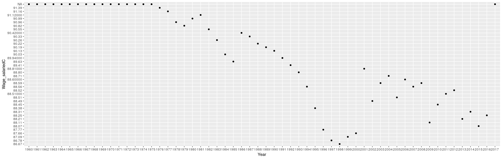  
##### Figure 11: Employment in industry, female (% of female employment) AU
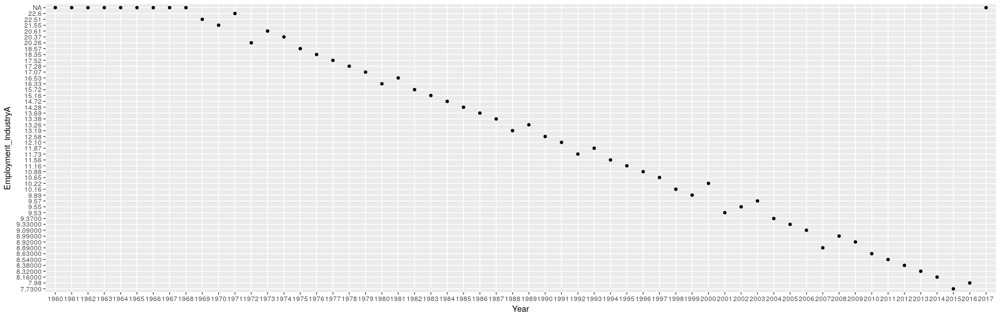  
##### Figure 12: Employment in industry, female (% of female employment) CA
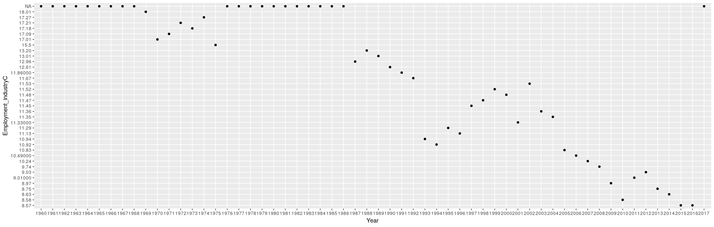  

#### Q3: The preference (or cultural) shift towards market work
The article highlights the shifting cultural norms for women at home and in the labor force as the key impact on the market preference for female work.

As society has been advancing recently, women have begun to work more. This shift towards market work is well documented in the data that we have graphed and are analyzing. The total percentage of women in the labor force is the best indicator of this trend. As seen by the graphs for both Canada and Australia, the percentage of women in the labor force has been steadily increasing, showing a shift from housework to market work (See Figures 13 and 14). To back this up, we also analyzed the labor force participation rate for women. This shows that the general trend, despite being somewhat erratic, has been increasing since the 1970s (See Figures 15 and 16). Our final variable that we analyzed was the percentage of women employers. This was one that went against the rest of our data. In Canada, it increased until 2000, and has since been declining. In Australia, it was very random until 2001 when it peaked, and has also been decreasing since then. (See Figures 17 and 18). This is interesting since as there have been more women working, one would assume that there would have been an increase in women employers as well.

All these factors support evidence cultural shift towards female market work. The results of our multi-linear regression summary for Australia produced a p-value of 2.2e-16 and a multiple R-squared percentage of 97%. Similarly for Canada, we got a p-value of 7.786e-11 and a multiple R-squared percentage of 87%. Based on these results, the female labor force participation rate and percent of female employers account for a large percentage of the variance in total female labor force. Overall we can agree with Heathcote's conclusion about the shift in female market work for both Canada and Australia.

##### Figure 13: Labor force, female (% of total labor force) AU
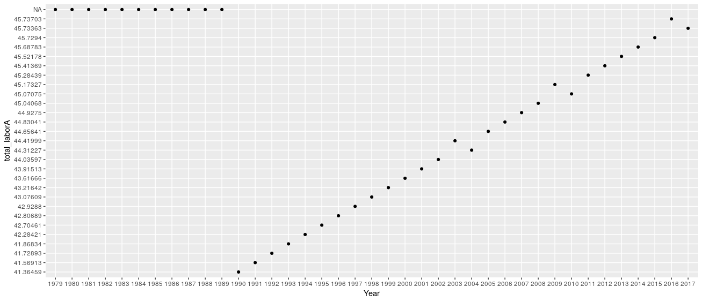
##### Figure 14: Labor force, female (% of total labor force) CA
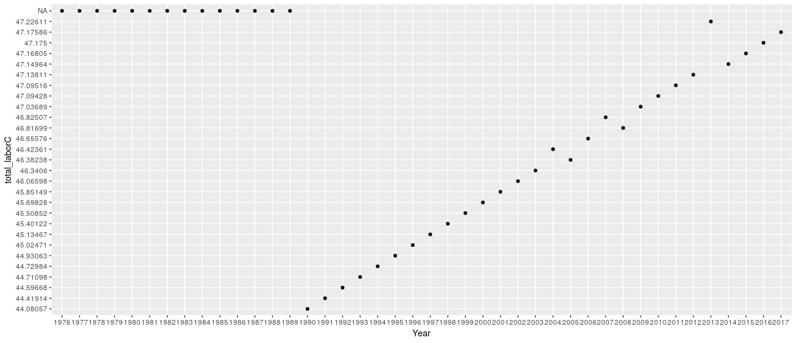
##### Figure 15: Labor force participation rate, female (% of female population ages 15+) (national estimate) AU
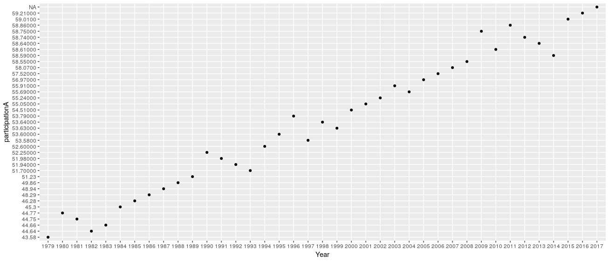
##### Figure 16: Labor force participation rate, female (% of female population ages 15+) (national estimate) CA
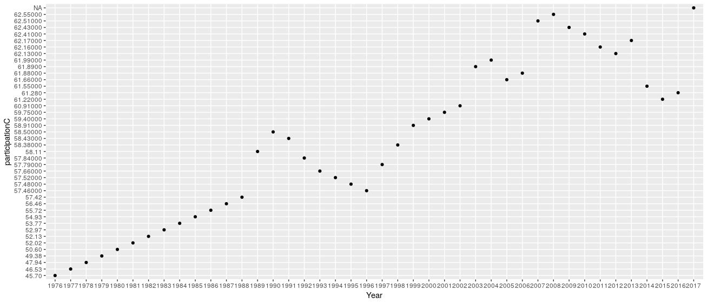  
##### Figure 17: Employers, female (% of female employment) AU
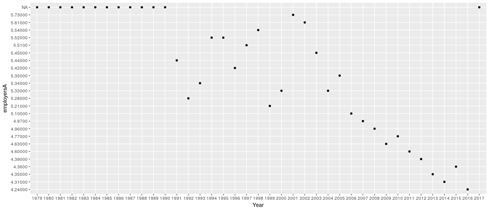  
##### Figure 18: Employers, female (% of female employment) CA
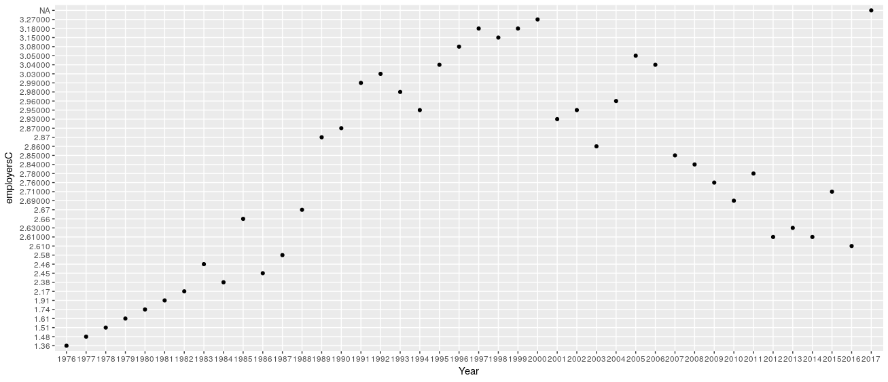  

#### Q4: The change in women’s bargaining power within the household.
The article states that bargaining power within a household originates from whoever works the most hours and earns the highest wages.

As more women join the workforce and become educated, their prevalence in household decisions increases. In Canada, women are becoming more self employed (See Figure 19), but at the same time the percentage of women earning wages and salaries is decreasing (See Figure 20). At the same time however, Australian women that work wage and salaried jobs is increasing (See Figure 21) while the percentage of self employed women is decreasing (See Figure 22). The difference between the two countries is very interesting since they seem to be opposites despite being two similar countries (developed, western). Despite these differences, as we have seen previously, women are still working more in general. We also analyzed the unemployment for women with advanced educations which, in general, showed that unemployment for this demographic is decreasing. Due to the erratic nature of the economy, it is hard to get concrete data for this analysis (See Figures 23 and 24). Overall, with unemployment for educated women decreasing, as well as women becoming employed, whether it is wages, salaried or self employment, women are going to be earning more money than previously. As they earn more money, they have gain more bargaining power in the household since they are able to contribute more.

All of these factors contribute to bargaining power proven by the results of our multi-linear regression. For both Australia and Canada we got a p-value of 2.2e-16, and a likely false multiple R-squared percentage of 100%. Based on these results, the percentage of unemployed but educated women and the percent of self employed women perfectly explains the variance in the percentage of salaried female workers. The statistical significance of this effect is likely inaccurate due to missing or outlier data, either making our analysis completely unreliable. Despite this, our p-values are very small, and so we can still agree with Heathcote's conclusion about bargaining power in the household.

##### Figure 19: Self-employed, female (% of female employment) CA
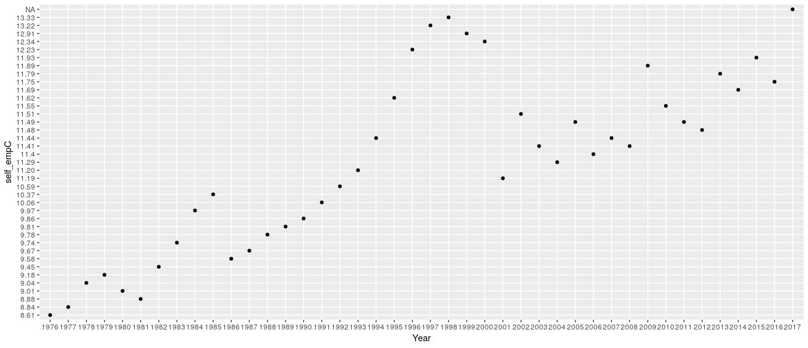
##### Figure 20: Unemployment with advanced education, female (% of female labor force with advanced education) CA
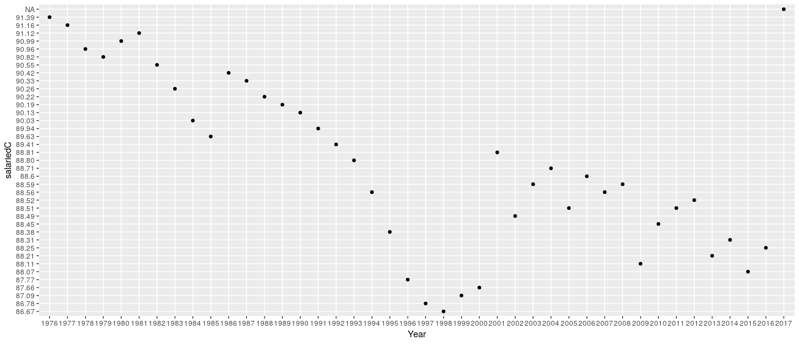
##### Figure 21: Unemployment with advanced education, female (% of female labor force with advanced education) AU
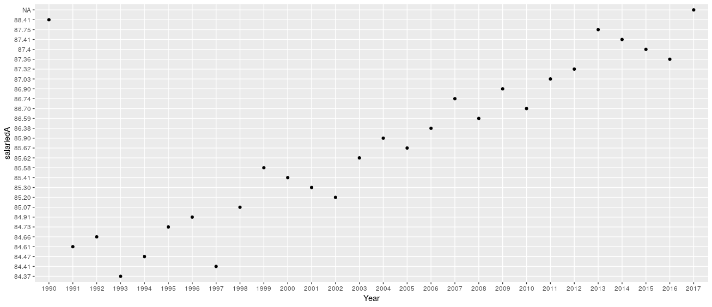
##### Figure 22: Self-employed, female (% of female employment) AU
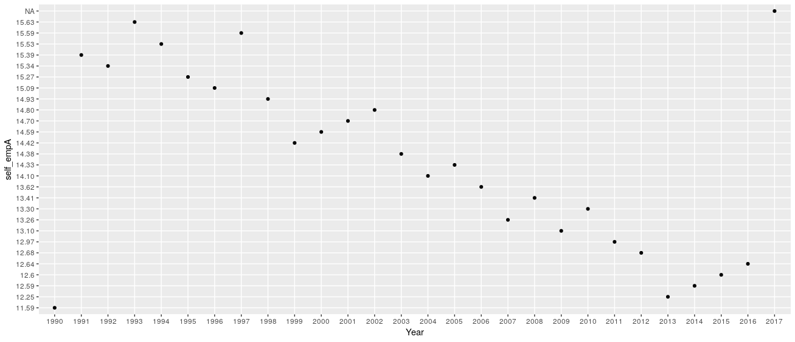  
##### Figure 23: Unemployment with advanced education, female (% of female labor force with advanced education) AU
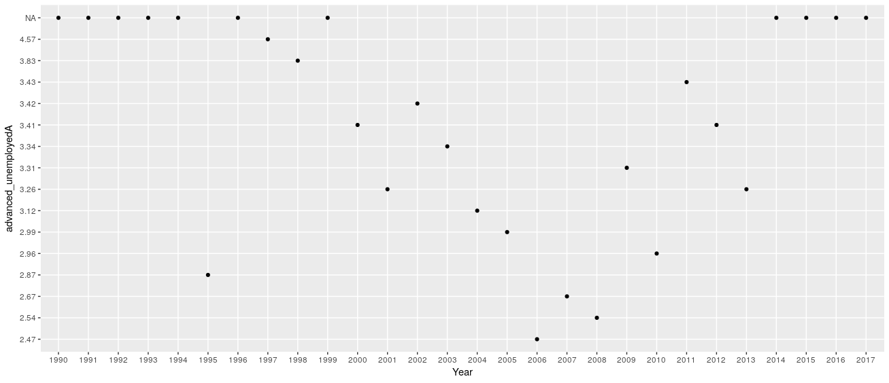  
##### Figure 24: Unemployment with advanced education, female (% of female labor force with advanced education) CA
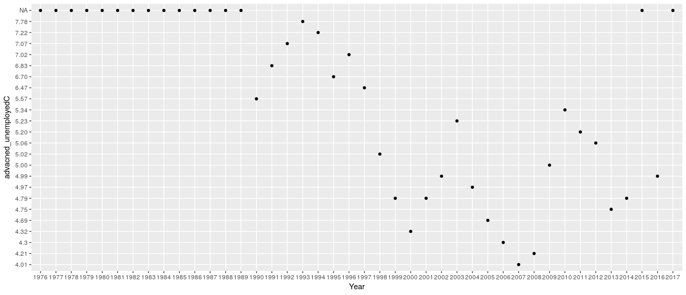  

### Reflection

One of the key differences between the last two labs has been how we analyze the data. For psych, there was much less numeric data due to using surveys. Graphing was not as prevalent with less data and data that was based on a 7 point scale. Due to this, we relied more on our interpretations of the questions and responses rather than raw data. As Dr. Eckstein mentioned in her talk, we had to take social aspects into account for our analysis in the psych lab, which made us think more in depth about the rational behind questions and the responses.

In this lab, however, we were able to find much more numeric data thanks to economics being heavily involved in numbers and graphs to see trends. By having more varied data, we were able to see trends more easily and in doing so, we were able to analyze the data quicker. Given the data we had, we quickly noticed a point that Professor Onyeiwu mentioned, which was that the data had no shelf life (it was always relevant) but it was hard to find. The excel sheet we used had many gaps in the data that we had to adjust for, mainly by finding other relevant data that actually had a usable amount of data.

Even with these differences, there were also similarities. We used similar graphing and tests (p-values) in order to transform the raw data into useful information that was easy to be interpreted. We also used similar rationals for trying to understand the social aspects of both the psychology lab and the economics lab since they both had trends that were influenced by society. Seeing as economics and psychology are both social sciences, it makes sense that they have similarities, yet subtle differences.
